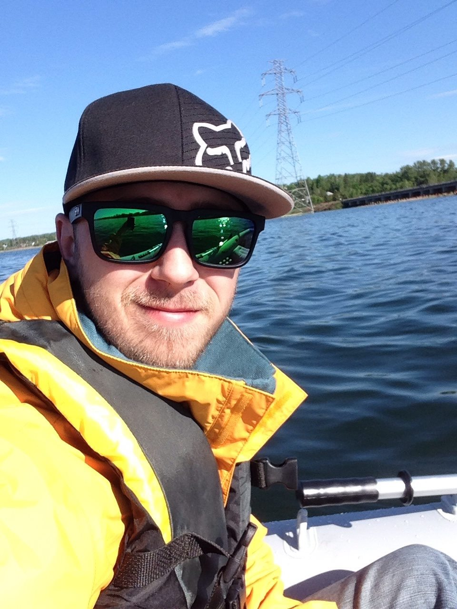

<section style="font-size: 16px;" align="center">

  <section>
  <h2>
    🖥️ Welcome to my Github profile! 🖥️
  </h2>

  <h3>
    <samp>My name is Jordan Atkins</samp>
  </h3>
  
 && 

  
[ I am a junior full stack <strong>developer</strong>! ]

  

    
    
    
    
  

  </section>
  <section style="margin-inline: 20px;font-family: Inter; font-size: 16px;" align="left">
  <h2>About Me</h2>
  

    
    
  🧑🏼‍💻 &emsp; Excited to grow my knowledge 
  🚗 &emsp; Favorite auto sport is F1! 
  🎣 &emsp; Enjoy a day out fishing 
  🧩 &emsp; I love Problem solving 
  

  
My name is Jordan Atkins, I have an extensive backbround in the Oil & Gas industry as a Journeyman B-Pressure welder.

  
Over the years, my experience has lead me to a passion of constant learning, passing knowledge to those who seek to better themselves and gain excitement when an issue arises. Especially ones that I have had the experience solving in the past.

  
With my life experience, I bring passion and drive into my new carrer of web development. Wanting a healthier life style for me and my family, and the encouragement of my wife. I took the leap and dove head first into continuing my education with the help of Lighthouse Labs, through their Web Development bootcamp.

   
As I pursue a role in the tech-industry, I hold myself accountable to build upon my knowledge and write code everyday. It's ok to miss a day, but my rule is not to miss days consistently.

  </section>

<h2>Use To Code</h2>
  
<strong>Languages</strong>

   
  
  
  
  

   

  
<strong>FrameWorks</strong>

   
  
  
  
  
  
  
  
  
  
  
   

<h2>Use To Test</h2>
 

 

<h2>Systems & Databases</h2>
 

 
<h2>Learning In Progress</h2>
 

<h2>Bucket-List To Learn</h2>
 

</section>